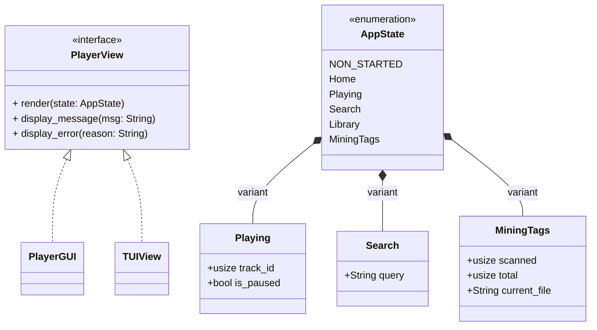
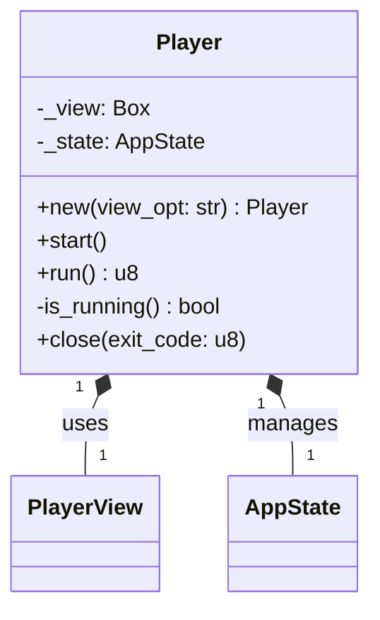
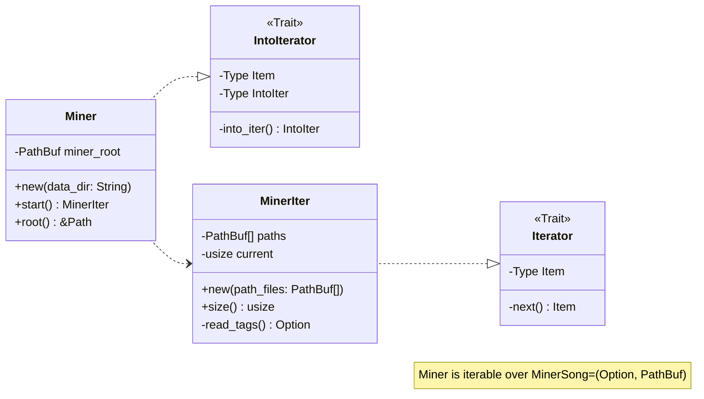
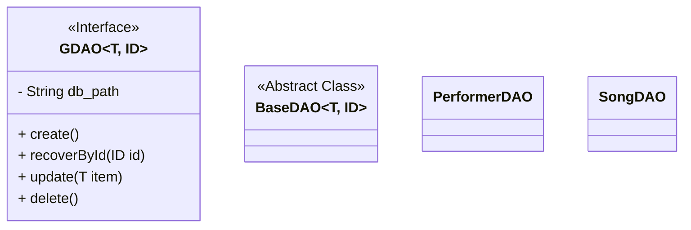

Language: **Rust**

### View UML

```mermaid
classDiagram

    PlayerView <|.. PlayerGUI 
    PlayerView <|.. TUIView

    class PlayerView {
        <<interface>>
        + render(state: AppState)
        + display_message(msg: String)
        + display_error(reason: String)
    }

    class AppState {
        <<enumeration>>
        NON_STARTED
        Home
        Playing
        Search
        Library
        MiningTags
    }

    class Playing {
        +usize track_id
        +bool is_paused
    }

    class Search {
        +String query
    }

    class MiningTags {
        +usize scanned
        +usize total
        +String current_file
    }

    AppState *-- Playing : variant
    AppState *-- Search : variant
    AppState *-- MiningTags : variant
```

### Controller UML

```mermaid 
classDiagram
    Player "1" *-- "1" PlayerView : uses
    Player "1" *-- "1" AppState : manages
    
    class Player {
        -_view: Box<dyn PlayerView>
        -_state: AppState
        +new(view_opt: str) Player
        +start()
        +run() u8
        -is_running() bool
        +close(exit_code: u8)
    }
```

### Miner

```mermaid
classDiagram
direction RL
    note "Miner is iterable over MinerSong=(Option<Song>, PathBuf)"
    Iterator <|.. MinerIter
    IntoIterator <|.. Miner
    MinerIter <.. Miner
    

    class Miner {
        -PathBuf miner_root 
        +new(data_dir: String)
        +start() MinerIter
        +root() &Path
    }

    class MinerIter {
        -PathBuf[] paths
        -usize current
        +new(path_files: PathBuf[])
        +size() usize
        -read_tags() Option<Song>
    }
    
    class IntoIterator{
        <<Trait>>
        -Type Item 
        -Type IntoIter
        -into_iter() IntoIter
    }

    class Iterator {
        <<Trait>>  
        -Type Item
        -next() Item
    }
```

### Database

```mermaid
classDiagram
    class GDAO~T, ID~ {
        <<Interface>>
        - String db_path
        + create()
        + recoverById(ID id)
        + update(T item) 
        + delete()
    }
    
    class BaseDAO~T, ID~ {
        <<Abstract Class>>
    }
    
    class PerformerDAO {

    }

    class SongDAO {

    }

```
