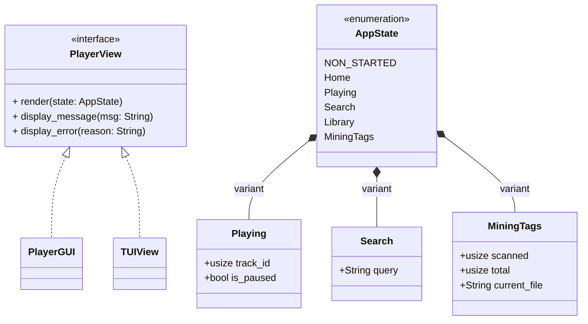
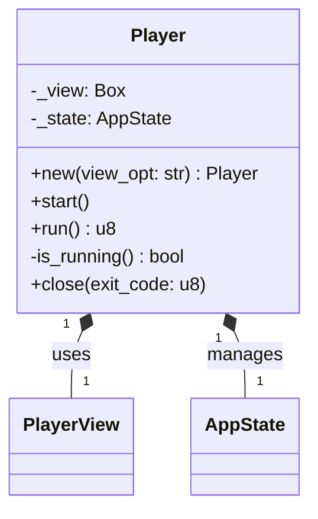
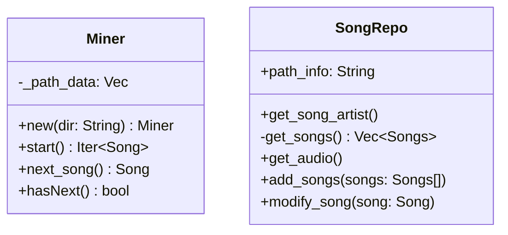

Language: **Rust**

### View UML

```mermaid
classDiagram

    PlayerView <|.. PlayerGUI 
    PlayerView <|.. TUIView

    class PlayerView {
        <<interface>>
        + render(state: AppState)
        + display_message(msg: String)
        + display_error(reason: String)
    }

    class AppState {
        <<enumeration>>
        NON_STARTED
        Home
        Playing
        Search
        Library
        MiningTags
    }

    class Playing {
        +usize track_id
        +bool is_paused
    }

    class Search {
        +String query
    }

    class MiningTags {
        +usize scanned
        +usize total
        +String current_file
    }

    AppState *-- Playing : variant
    AppState *-- Search : variant
    AppState *-- MiningTags : variant
```

### Controller UML

```mermaid 
classDiagram
    Player "1" *-- "1" PlayerView : uses
    Player "1" *-- "1" AppState : manages
    
    class Player {
        -_view: Box<dyn PlayerView>
        -_state: AppState
        +new(view_opt: str) Player
        +start()
        +run() u8
        -is_running() bool
        +close(exit_code: u8)
    }
```

```mermaid
classDiagram
    class Miner {
        -_path_data: Vec<String>
        +new(dir: String) Miner
        +start() Iter~Song~
        +next_song() Song
        +hasNext() bool
    }
    class SongRepo {
        +path_info: String
        +get_song_artist()
        -get_songs() Vec~Songs~
        +get_audio()
        +add_songs(songs: Songs[])
        +modify_song(song: Song)
    }
```
