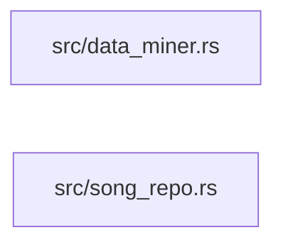

## Backend

Language: **Rust**

Files Description:
- data_miner.rs: ADS to model deciphering the information off a mp3 files directory.
- song_repo.rs: ADS to allow querying information. (In this case off of a database).

