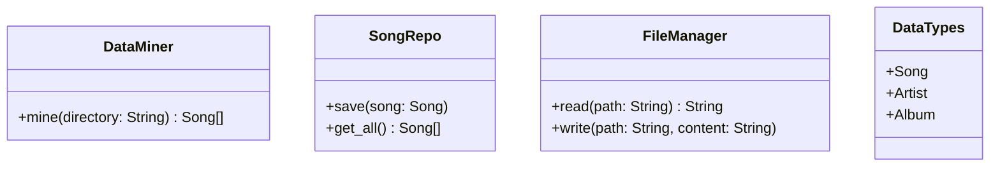
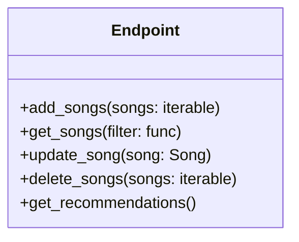
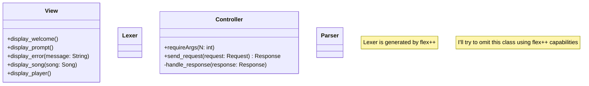

## Backend

Language: **Rust**

Files Description:
- data_miner.rs: ADS to model deciphering the information off a mp3 files directory.
- song_repo.rs: Interface with the information. (In this case off of a database).

**General Purpose:**
- file_manager.rs: Write to files and read files.
- data_types.rs: Types declaration. 
    - Song 
    - Artist 
    - Album

## API

Language: Python

Optimally its going to generate the doc

## FrontEnd

Language: Flutter

NOTES/TODO: 
- how to implement responses and requests

**Method Description**: 
+requireArgs(N: int) String[]: Check for exactly N arguments

