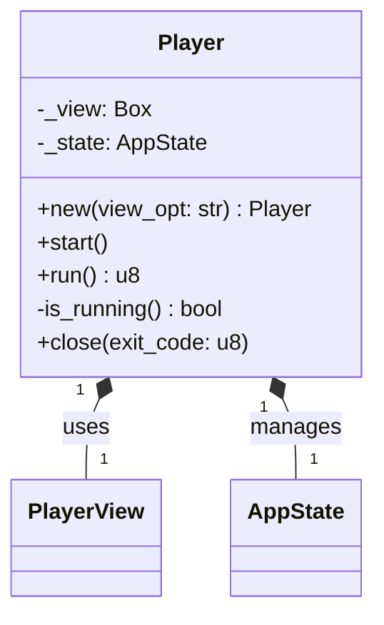
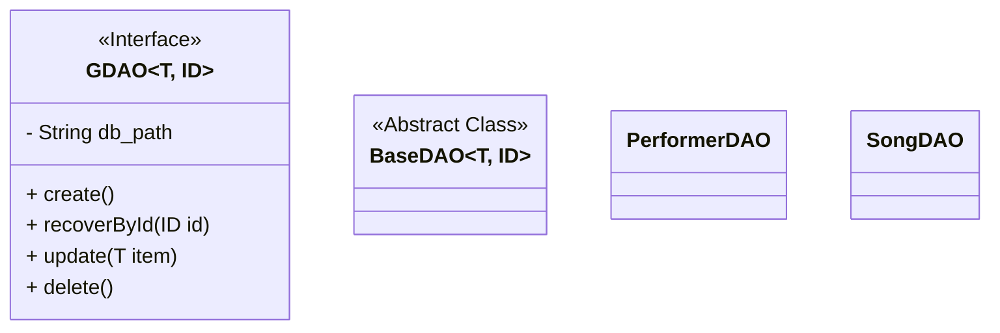

Language: **Rust**

### Controller UML

```mermaid 
classDiagram
    Player "1" *-- "1" PlayerView : uses
    Player "1" *-- "1" AppState : manages
    
    class Player {
        -_view: Box<dyn PlayerView>
        -_state: AppState
        +new(view_opt: str) Player
        +start()
        +run() u8
        -is_running() bool
        +close(exit_code: u8)
    }
```

### Database

```mermaid
classDiagram
    class GDAO~T, ID~ {
        <<Interface>>
        - String db_path
        + create()
        + recoverById(ID id)
        + update(T item) 
        + delete()
    }
    
    class BaseDAO~T, ID~ {
        <<Abstract Class>>
    }
    
    class PerformerDAO {

    }

    class SongDAO {

    }

```
