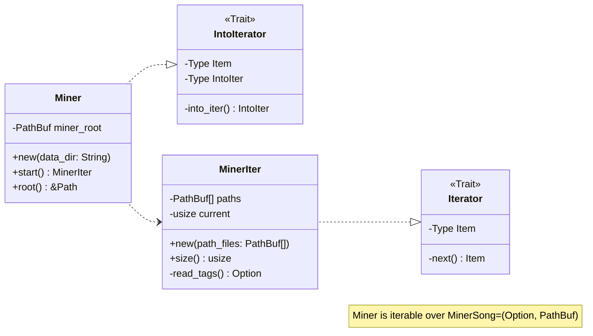

### Miner

```mermaid
classDiagram
direction RL
    note "Miner is iterable over MinerSong=(Option<Song>, PathBuf)"
    Iterator <|.. MinerIter
    IntoIterator <|.. Miner
    MinerIter <.. Miner
    

    class Miner {
        -PathBuf miner_root 
        +new(data_dir: String)
        +start() MinerIter
        +root() &Path
    }

    class MinerIter {
        -PathBuf[] paths
        -usize current
        +new(path_files: PathBuf[])
        +size() usize
        -read_tags() Option<Song>
    }
    
    class IntoIterator{
        <<Trait>>
        -Type Item 
        -Type IntoIter
        -into_iter() IntoIter
    }

    class Iterator {
        <<Trait>>  
        -Type Item
        -next() Item
    }
```
