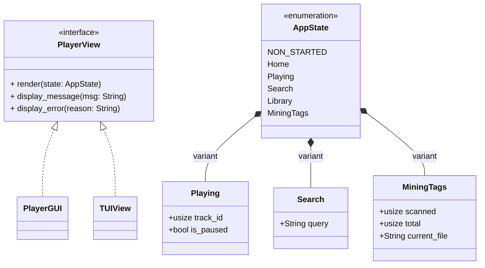

### View UML

```mermaid
classDiagram

    PlayerView <|.. PlayerGUI 
    PlayerView <|.. TUIView

    class PlayerView {
        <<interface>>
        + render(state: AppState)
        + display_message(msg: String)
        + display_error(reason: String)
    }

    class AppState {
        <<enumeration>>
        NON_STARTED
        Home
        Playing
        Search
        Library
        MiningTags
    }

    class Playing {
        +usize track_id
        +bool is_paused
    }

    class Search {
        +String query
    }

    class MiningTags {
        +usize scanned
        +usize total
        +String current_file
    }

    AppState *-- Playing : variant
    AppState *-- Search : variant
    AppState *-- MiningTags : variant
```
